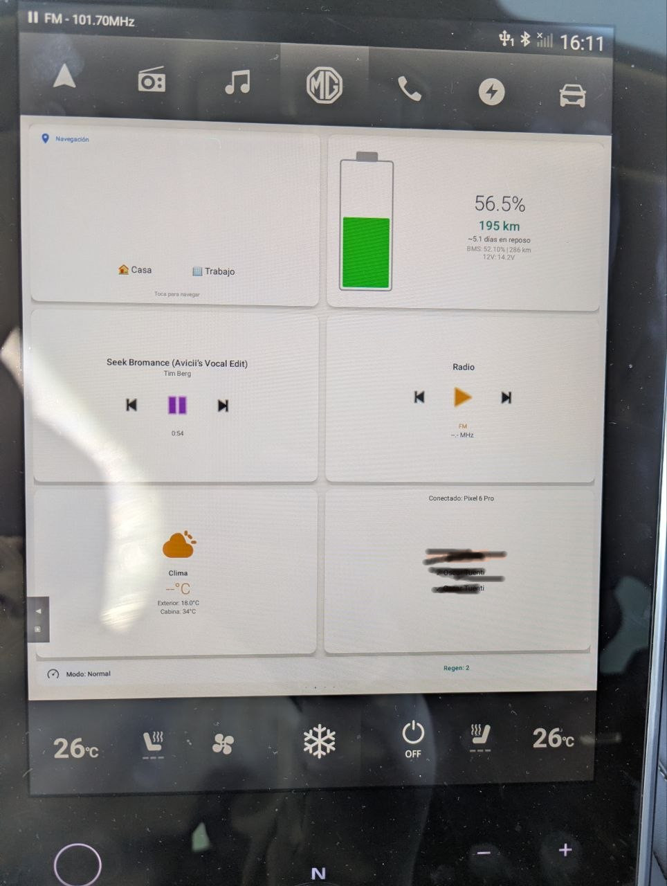
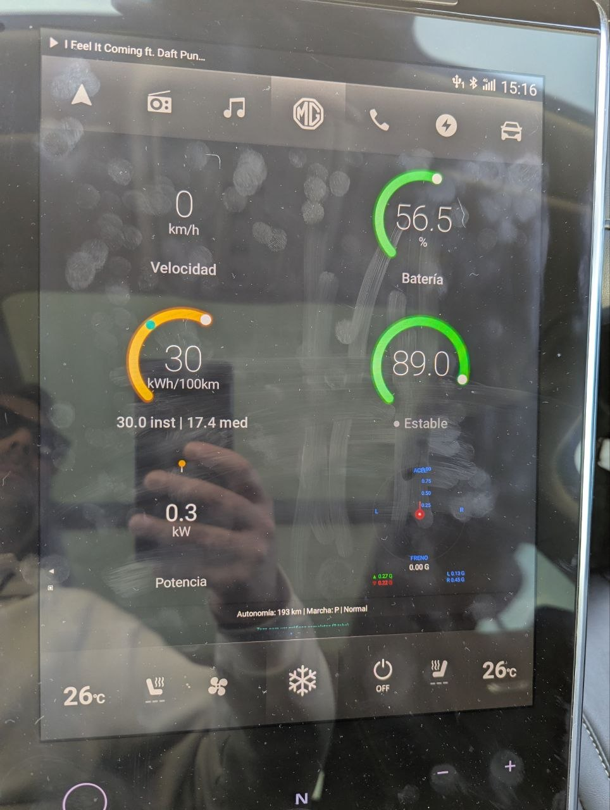
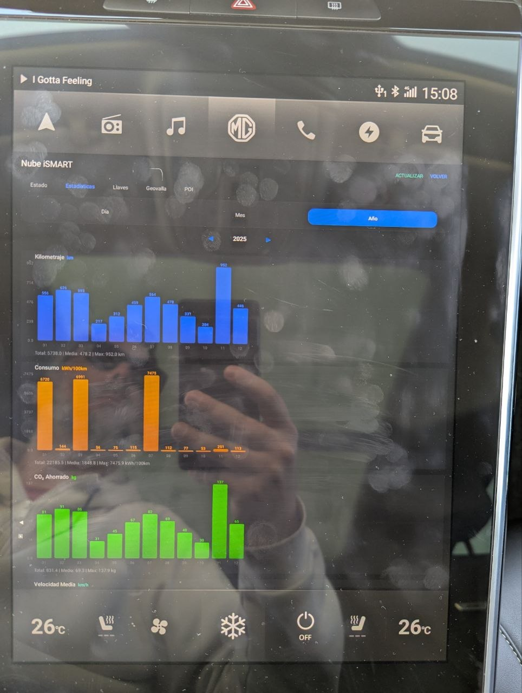
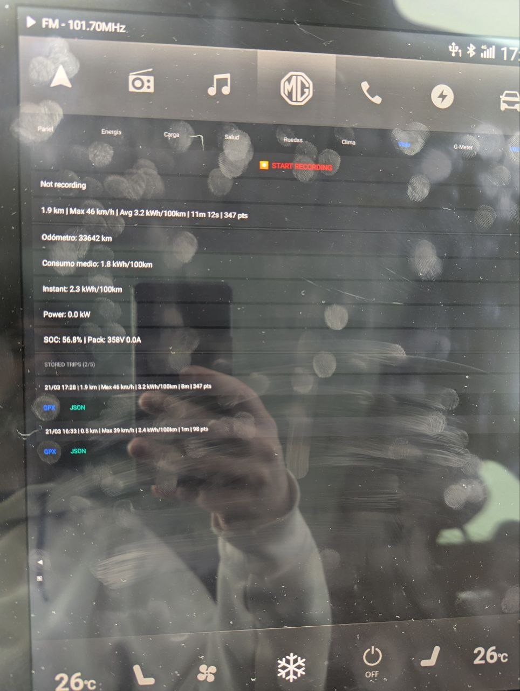

# Emegelauncher

A custom home screen launcher for the **MG Marvel R** electric vehicle, designed to provide deep vehicle telemetry, real-time graphs, cloud integration, and a modern UI on the car's 19.4" portrait infotainment display.

---

> **IMPORTANT DISCLAIMER**
>
> This software is provided **as-is**, without warranty of any kind. The authors and contributors of Emegelauncher assume **no responsibility or liability** for any damage, malfunction, or unintended behavior that may occur to your vehicle, its systems, or any connected devices as a result of installing or using this application.
>
> By using this software, you acknowledge that:
> - Modifying your vehicle's head unit software may void your warranty
> - This is an **independent community project**, not affiliated with, endorsed by, or supported by MG, SAIC Motor, or any of their subsidiaries
> - You install and use this application **entirely at your own risk**
> - Always ensure your vehicle is safe to operate after any software modification
>
> If you are unsure about any aspect of this software, **do not install it**. Consult a qualified professional.

> **SECURITY & PRIVACY NOTICE**
>
> This application runs with **system-level privileges** on your vehicle's head unit. By design, it has access to sensitive data including but not limited to:
> - Vehicle Identification Number (VIN), MAC addresses, and serial numbers
> - Authentication tokens, encryption keys, and server credentials
> - GPS location and driving history
> - All vehicle telemetry (speed, battery, charging sessions)
> - Bluetooth paired devices, WiFi credentials, and hotspot passwords
> - MG iSMART cloud account credentials (if cloud features are used)
>
> **Only install this application from the official source repository.** Modified versions obtained from third parties could silently exfiltrate this data to external servers. Before installing any build you did not compile yourself, **review the source code**.

> **BETA SOFTWARE**
>
> This application is currently **in active development**. Some features may not work as expected, and new functionality is being added regularly. If you encounter any bugs or unexpected behavior, please [open an issue](../../issues) on this repository. Your feedback helps improve the project for everyone.

---

## Screenshots

| Main Screen | Live Dashboard |
|---|---|
|  |  |

| Cloud Statistics | Trip Recorder |
|---|---|
|  |  |

---

## Features

### 4-Screen Swipeable Launcher
Horizontal ViewPager with 4 pages: **Graphs ← Main → Apps → Other**

### Main Screen (default)
- **Weather**: Dynamic weather icon (sunny/cloudy/rain/snow/fog/storm), forecast temp, outside sensor temp, cabin temp from cloud (when available). Tap opens weather app.
- **Battery**: Dynamic battery fill icon (120dp) showing SOC level (green >50%, orange 20-50%, red <20%), SOC percentage, range, standby estimate, BMS raw data, 12V battery voltage from cloud. Tap opens car's charge management screen.
- **Navigation card**: Live turn-by-turn info when navigating (road name, distance/time remaining, speed limit badge). Quick Home/Office buttons when idle. Tap opens Telenav
- **Music card**: Album art background, song title + artist (marquee scroll), play/pause/next/prev controls (88px touch targets), elapsed time. Via Android MediaSessionManager (BT/USB/streaming). Tap opens music app
- **Radio card**: Station name, seek up/down controls (72px), frequency + FM/AM type below. Tap opens radio app
- **Phone card**: Connected BT device name, last 3 calls with type icons (↙ incoming/↗ outgoing/↙ missed), tap call to dial. Pulsing green border on incoming call. Wireless charger status. Read-only — tap opens phone app
- **Drive Mode bar**: Current mode (Eco/Normal/Sport/Winter) + regen level
- **Auto Theme**: Follows car display (day/night), or manual dark/light override
- **Layout**: Row 1: Navigation | Battery. Row 2: Music | Radio. Row 3: Weather | Phone

### Live Dashboard (swipe left)
- **4 gauges**: Speed, Battery SOC, Consumption (dual-dot: instant from power÷speed, BMS-calculated session average), Eco Score — animated with color-coded labels (orange instant, teal average)
- **Eco Score**: Session-aggregate driving efficiency score (exponential moving average, ~30s time constant) with live behavior arrows (red=hard accel, orange=accelerating, green=regen/coasting, gray=steady). Gauge arc color: green >70, orange 40-70, red <40
- **Power gauge**: Centered zero-point arc (orange=consumption, green=regen), animated transitions
- **G-Meter**: Round 2D G-force visualization (1G max), longitudinal G from speed derivative, lateral G from steering wheel angle. Peak accel/brake/left/right values displayed below
- **Info bar**: Range, gear, drive mode — all live data updated every 1 second
- Tap opens full 8-tab GraphsActivity

### Vehicle Graphs (8 tabs)
| Tab | Content |
|---|---|
| **Dashboard** | Speed, SOC, Consumption, Eco Score gauges + energy flow + G-force + gear/range/mode |
| **Energy** | SOC (display + BMS raw), pack voltage, pack current, consumption (kWh/100km) |
| **Charging** | Live power/current/voltage charts when charging, stored session data when idle |
| **Health** | Auto-calculated SOH estimation, capacity tracking, charge session history |
| **Tires** | Top-down car silhouette with 4-corner pressure + temperature, color-coded (2.5-3.3 bar) |
| **Climate** | HVAC status, outside temp, air quality sensors |
| **Trip** | Trip Recorder (start/stop, GPX/JSON export to USB/storage), odometer, live consumption/power, stored trip history (max 5) |
| **G-Meter** | 2D G-force circle with peak tracking, longitudinal/lateral charts, regen level, one-pedal status |

### Trip Recorder
Record GPS tracks while driving with full vehicle telemetry. Accessible from the Trip tab in Vehicle Graphs.

- **Start/Stop** recording button — singleton pattern, continues recording across all screens
- **Live data** per point: timestamp, GPS lat/lon, speed, power (kW), SOC%, consumption (kWh/100km), G-forces
- **Export**: GPX (Google Earth compatible) + JSON (full telemetry) — storage selection dialog shows all available USB drives and internal storage
- **Stored trips**: Last 5 trips kept with auto-pruning of oldest. Each trip shows summary (distance, max speed, avg consumption, duration, point count)
- **Per-trip export buttons**: GPX and JSON buttons for each stored trip

### iSMART Cloud Integration
Connects to MG's cloud API for data not available locally. Auto re-login on token expiry. Cloud queries trigger automatically once TBox is online and internet connectivity is confirmed.

**Vehicle status** (fetched when TBox + internet detected):
- Cabin temperature, 12V battery voltage (÷10 scaling, with charging/resting/low status notes)
- All doors/windows/locks/lights/tyres/sunroof status
- Trip data (mileage today, since charge, current journey, odometer)
- Power mode, engine status, EV range, seat heating, steering heat

**Driving statistics** (interactive):
- Segmented control: Day / Month / Year (pill-style toggle with highlighted selection)
- Date navigation: ◀ date ▶ arrows
- 5 bar charts with x-axis date labels: Mileage, Consumption, CO₂ Saved, Avg Speed, Travel Time
- Y-axis grid with value labels, value annotations above bars
- Current period bar highlighted, summary row (Total / Avg / Max) per chart
- All labels translated (EN/ES)

**BT Digital Key management**: View keys with status/MAC/validity, activate/deactivate/revoke

**Geofence**: View current config, create at GPS position with radius, delete

**Send POI to car navigation**: Current position (from SAIC nav service) or custom coordinates, favorites list

All cloud features are **greyed out and disabled** when not logged in.

### Apps Screen (swipe right)
- **Top half**: Scrollable 4-column grid of user-installed apps (system apps hidden)
- **Bottom half**: 4-3-3 button grid — CarPlay, Android Auto (disabled when not connected), Video, 360 View (disabled when no cameras), Car/System/Launcher Settings, Rescue, MG Support, Manual

### Other Screen (swipe far right)
- **Tool buttons**: Diagnostics, Vehicle Info, Location, TBox, Cloud, USB Camera
- **Cloud status**: Login state, cabin temp, 12V battery, TBox status
- **Quick actions**: Force data refresh, overlay toggle

### USB Camera (UVC)
- User-space UVC camera support via AndroidUSBCamera library (jiangdongguo)
- Lists connected USB cameras with VID/PID/interface details
- Tap to open preview on AspectRatioTextureView
- Extensive debug logging for troubleshooting

### Navigation Proxy
Registers as system handler for `geo:` and `google.navigation:` URI intents, forwarding to Telenav. Any third-party app can send addresses to the car's navigation.

### Vehicle Info
100+ data points: Identity, Status, Battery, HVAC, ADAS (AEB, FCW, BSD, LKA, TJA, RCTA), APA, drive mode, Comfort, Doors/Windows, ECU status, Maintenance, Lights, System, Sensors, Cloud data, Vehicle Overseas security info.

### TBox (Telematics)
EngMode vehicle status, hardware info beans (GNSS, BT, mobile, WiFi with full field extraction), TBox network, Vehicle Overseas security data (server URL, auth token, AVN ID).

### Location & GPS
GPS position, satellites, street address from SAIC navigation service, JSON snapshot, DMS/UTM formats.

### Diagnostics
- 943 VHAL properties + 252 SAIC methods with filtering
- AIDL TX code enumeration for all 5 SAIC services
- Export: Logcat, diagnostics dump (TX codes, binder info), charge session data, or all

### Settings
- Theme (Auto/Dark/Light), default launcher, overlay toggle
- MG iSMART cloud login/logout with auto re-login
- Driver profile (save/restore settings — read-only on Marvel R, no regen/drive mode setters available)
- Key capture mode (20Hz VHAL + Android KeyEvent interception)
- AIDL TX code viewer (all services)
- Storage export (logcat, diagnostics, charge data)
- Version info + licenses/acknowledgments

### First-Run Disclaimer
Mandatory legal disclaimer on first launch. Cannot be bypassed — must accept to use the app.

---

## Architecture

Emegelauncher uses a **7-layer service architecture** to access vehicle data, entirely through **Java reflection** — no proprietary libraries are compiled or bundled.

```
Layer 1: Android Car API
  |- CarPropertyManager --- 943 VHAL properties
  |- CarHvacManager / CarBMSManager

Layer 2: SAIC VehicleSettingsService (via DexClassLoader)
  |- IVehicleSettingService    (128 TX codes: ADAS, comfort, ambient)
  |- IVehicleConditionService  (27 methods: ECU status, maintenance)
  |- IVehicleChargingService   (25 methods: charging, battery, regen)
  |- IVehicleControlService    (12 methods: doors, windows, ESP)
  |- IAirConditionService      (26 methods: HVAC, seat heat)

Layer 3: EngineerModeService
  |- ISystemSettingsManager (ADB, speed, gear, power)
  |- ISystemHardwareManager (GNSS, BT, mobile, WiFi beans)

Layer 4: SaicAdapterService (3 sub-services)
Layer 5: SystemSettingsService (8 sub-services)
Layer 6: vehicleService_overseas

Layer 7: MG iSMART Cloud API
  |- OAuth2 + AES/CBC encryption + HMAC-SHA256 verification
  |- Auto re-login on 401 (token expiry)
  |- Vehicle status (cabin temp, 12V battery ÷10, trip data)
  |- Statistics (day/month/year with 5 metric types)
  |- BT digital key management (activate/deactivate/revoke)
  |- Geofence, POI (via SAIC nav service GPS), FOTA

Layer 8: USB Camera (UVC)
  |- AndroidUSBCamera library (jiangdongguo v3.2.3)
  |- User-space UVC via USB Host API (no kernel driver needed)
  |- Device detection, permission, preview on TextureView
```

---

## No Proprietary Code

This project contains **zero proprietary MG/SAIC code**. Verified by automated scan of all source files, imports, dependencies, and binary assets.

**Source code:**
- **Zero proprietary imports** — no `com.saicmotor.*`, `com.saicvehicleservice.*`, `com.yfve.*`, or `android.car.*` imports anywhere in the codebase
- All vehicle services are accessed entirely through **Java reflection** (`Class.forName()`, `Method.invoke()`, `DexClassLoader`)
- SAIC class names appear only as **string literals** for runtime reflection lookups
- AIDL stub classes are loaded at runtime via `DexClassLoader` from APKs already installed on the car's system partition — no stubs are compiled or bundled

**Dependencies:**
- `androidx.appcompat:1.1.0` and `androidx.constraintlayout:1.1.3` (standard Android Jetpack)
- `AndroidUSBCamera:libausbc:3.2.3` + `libuvc:3.2.3` (open-source UVC camera, JitPack)
- **No proprietary JARs, AARs, or native .so libraries** from MG/SAIC in the project

**Cloud API:**
- The iSMART cloud encryption protocol (AES/CBC/PKCS5Padding with MD5-derived keys, HMAC-SHA256 request verification) is **reimplemented from scratch** using standard Java crypto libraries (`javax.crypto.Cipher`, `MessageDigest`, `Mac`)
- No code was copied from MG apps — the protocol was reverse-engineered from the open-source NewMGRemote project

**Resources:**
- **No proprietary images, icons, layouts, or assets** copied from any MG/SAIC application
- VHAL property IDs in `YFVehicleProperty.java` are numeric constants — factual hardware register addresses, not copyrightable code

---

## Building

### Local Build

**Requirements:**
- Java 11 (`openjdk-11-jdk`)
- Android SDK with Build Tools 28.0.3
- AOSP platform signing key (`platform.keystore`)

```bash
JAVA_HOME=/usr/lib/jvm/java-11-openjdk-amd64 ./gradlew assembleDebug
```

Output: `app/build/outputs/apk/debug/app-debug.apk`

---

## Installation

> **WARNING: Only download Emegelauncher from this official repository.** This application runs with full system privileges on your vehicle's head unit. A tampered version from an untrusted source could silently access your vehicle data, credentials, GPS location, and cloud accounts. If you did not build the APK yourself, only trust releases published on this GitHub page.

### What you need

- The APK file (download from [Releases](../../releases) or build it yourself)
- A USB memory stick formatted as **FAT32**

### First-time installation

1. **Prepare the USB**: Copy the `.apk` file to the **root** of the FAT32 USB drive. Insert the drive into the **left USB port** behind the infotainment screen.

2. **Open Android Settings**: Since the MG Marvel R doesn't expose the Settings app directly, use this workaround:
   - Open **Amazon Music** (or any app that shows the Android keyboard)
   - Tap any text field so the keyboard appears
   - **Press and hold** the globe/language icon (🌐) on the keyboard until a gear icon (⚙) appears
   - Tap the **gear icon** — this opens Android Settings

3. **Find the Files app**: In the Settings search bar, type **"Applications"**. Once the Applications section appears, look for **"Files"** and tap it. The file manager will open.

4. **Install the APK**: In the file manager, look at the **left sidebar** — you'll see your USB drive listed. Tap it, then tap the **APK file**. Follow the prompts to install.

5. **Set as launcher**: After installation, press the **round HOME button** on the dashboard. A dialog will appear asking which launcher to use. Select **Emegelauncher** and choose **"Just once"** for testing. Once you're happy with it, you can choose **"Always"** to set it as the default launcher.

### Updating an existing installation

1. Copy the **new APK** to the root of your FAT32 USB drive and insert it into the left USB port.

2. From the launcher, swipe to the **Apps** page and open the **Files** app.

3. In the file manager, select the USB drive from the left sidebar and tap the **new APK file**. Confirm the installation.

4. After installation completes, the next time you press the **HOME button** the updated version will run automatically.

> **Sharing this project?** Please share the link to this GitHub page — not the APK file directly. This way, everyone gets the latest version, can verify the source code, and stays protected from tampered copies.

---

## Supported Languages

| Language | Status |
|---|---|
| English | Full support (default) |
| Spanish (Espa\u00f1ol) | Full support — all UI, settings, graphs, cloud, diagnostics, eco indicators, trip recorder, G-meter, disclaimer |

The app automatically uses the device locale. Additional languages can be added by creating a new `values-XX/strings.xml` resource file.

---

## Target Vehicle

| Spec | Value |
|---|---|
| Vehicle | MG Marvel R (EP21 platform) |
| Display | 19.4" portrait, 1024x1280px |
| OS | Android 9 Automotive (API 28) |
| Battery | 70 kWh nominal |
| Tire pressure | 2.9 bar recommended |

---

## Screens

| Screen | Activity | Description |
|---|---|---|
| Main | MainActivity (ViewPager) | 4-screen swipeable launcher: Graphs, Main, Apps, Other |
| Graphs | GraphsActivity | 8-tab live vehicle data with gauges and charts |
| Vehicle Info | VehicleInfoActivity | 100+ data points including cloud data |
| Location | LocationActivity | GPS, satellites, address, JSON snapshot |
| Cloud | CloudActivity | iSMART cloud: status, statistics, BT keys, geofence, POI |
| TBox | TboxActivity | EngMode hardware data, security info, TBox network |
| USB Camera | UvcCameraActivity | USB camera detection, preview via AndroidUSBCamera (UVC) |
| Diagnostics | DebugActivity | 943 VHAL + 252 SAIC, filter, TX codes, export |
| Settings | SettingsActivity | Theme, cloud login, profile, overlay, developer tools |

---

## Project Structure

```
app/src/main/java/com/emegelauncher/
|- MainActivity.java          # 4-screen ViewPager launcher (Graphs/Main/Apps/Other)
|- GraphsActivity.java        # 8-tab vehicle graphs
|- VehicleInfoActivity.java   # Vehicle data + cloud data display
|- LocationActivity.java      # GPS & location
|- CloudActivity.java         # iSMART cloud (5 tabs: Status, Stats, Keys, Geofence, POI)
|- TboxActivity.java          # TBox telematics + security info
|- UvcCameraActivity.java     # USB camera detection and preview (UVC)
|- NavProxyActivity.java      # geo: intent proxy to Telenav
|- DebugActivity.java         # Diagnostics (VHAL + SAIC)
|- SettingsActivity.java      # Settings, cloud login, profile, about
|- OverlayService.java        # Floating back/recent buttons (vertical)
|- ThemeHelper.java           # Dark/light theme management
|- vehicle/
|   |- VehicleServiceManager.java  # 6-layer local service architecture + TX codes
|   |- SaicCloudManager.java      # iSMART cloud API (auth, status, stats, keys, POI, geofence)
|   |- WeatherManager.java        # Weather broadcast + polling
|   |- BatteryHealthTracker.java   # SOH estimation from charge sessions
|   |- TripRecorder.java          # GPS track logger with GPX/JSON export (singleton)
|   |- YFVehicleProperty.java     # 943 VHAL property constants
|- widget/
    |- ArcGaugeView.java      # Arc gauge with animated value + label below
    |- PowerGaugeView.java    # Center-zero power gauge (consume/regen)
    |- LineChartView.java     # Line chart with auto-scaling
    |- GMeterView.java        # Circular G-force meter (1G max) with peak tracking
    |- BarChartView.java      # Bar chart with x-axis date labels (cloud statistics)
    |- TireDiagramView.java   # Top-down car silhouette + 4-corner tire pressure
    |- BatteryView.java       # Dynamic battery fill icon (SOC-based color)
```

---

## License

This project is licensed under **GNU General Public License v3.0** with the **Commons Clause License Condition v1.0**.

**You may**: use, modify, share, fork, and accept donations.

**You may NOT**: sell this software, offer it as a paid service, or bundle it in commercial products.

See [LICENSE](LICENSE), [LICENSE-GPL3](LICENSE-GPL3), and [LICENSE-COMMONS-CLAUSE](LICENSE-COMMONS-CLAUSE) for full details.

---

## Support the Project

Emegelauncher is a free, open-source project developed in my spare time. If you find it useful and would like to support continued development, donations are greatly appreciated.

**[Donate via PayPal](https://paypal.me/corvusmod)**

Your support helps fund testing hardware, development time, and new features. Thank you!

---

## Contributing

Contributions are welcome. By submitting a pull request, you agree that your contribution will be licensed under the same GPLv3 + Commons Clause terms.

## Acknowledgments

- Built using knowledge from Huseyin's DriveHub project's reflection-based approach
- AOSP platform signing key from the Android Open Source Project
- Cloud API protocol reverse-engineered from the NewMGRemote open-source project
- UVC camera support via [AndroidUSBCamera](https://github.com/jiangdongguo/AndroidUSBCamera) by jiangdongguo
